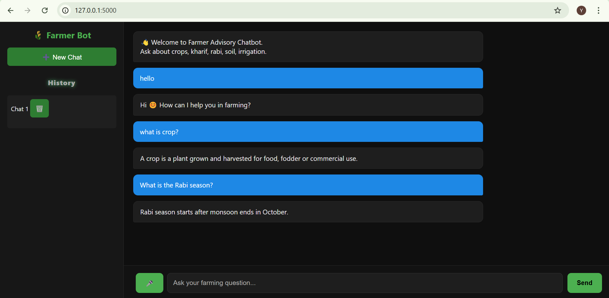
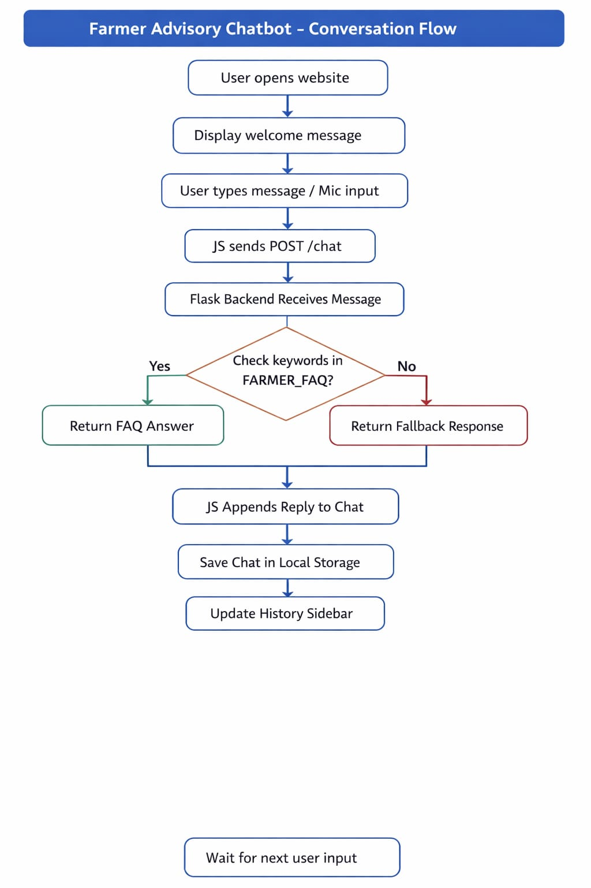

# farmer-advisory-chatbot
An intelligent Farmer Advisory Chatbot using Flask and FAQ-based responses with chat history and voice input support.

**Welcome!** This is a **web-based intelligent chatbot** designed to help farmers get quick and reliable advice about agriculture. It covers queries related to crops, irrigation, soil health, fertilizers, pests, and government agricultural schemes.

## 📌 What the Project Does

The **Farmer Advisory Chatbot** allows users to:

- Ask questions related to farming via **text input** or **voice input**.
- Receive **instant keyword-based answers** from a curated FAQ database.
- Track their **chat history**, revisit past conversations, and delete chats if needed.
- Use a **modern dark-themed user interface** for easy readability and interaction.

---

## 💡 Why the Project is Useful

- Helps farmers quickly access **agriculture-related information** without searching multiple sources.
- Provides **educational support** on Kharif and Rabi crops, irrigation methods, pest management, and more.
- Ensures **offline accessibility** for previously asked questions through local chat history.
- Supports **voice interaction**, making it convenient for farmers who may prefer speaking over typing.

---

## 🚀 How Users Can Get Started
Ensure Python 3.x is installed.
Install required packages:
pip install flask
Run the Flask backend server:
python app.py
Open your browser and navigate to:
http://127.0.0.1:5000
Start chatting with the Farmer Advisory Chatbot.

---

## **Tech Stack**

* **Frontend:** HTML, CSS, JavaScript  
* **Backend:** Python Flask  
* **Data Storage:** Browser `localStorage` for chat history  
* **Voice Input:** Web Speech API (`webkitSpeechRecognition`)  
* **Version Control:** Git + GitHub  

---

## **💬 Sample Dialogues**

User: What are Kharif crops?
Bot: Kharif crops are sown during the monsoon season (June–July) and harvested in September–October. Examples include rice, maize, cotton, and soybean.

User: My wheat plants need irrigation, how much water?
Bot: Wheat requires around 450–650 mm of water during its growth period. Proper scheduling prevents water stress.

User: How can I improve soil fertility?
Bot: Use organic compost, practice crop rotation, and apply green manure to maintain healthy soil.

User: Unknown question example
Bot: Thank you for your question 🌱. Currently, I don’t have an exact answer. Please ask another farming-related question.

## Project Screenshots

### Frontend

### Website View

### Backend

### Conversation Flow Diagram

